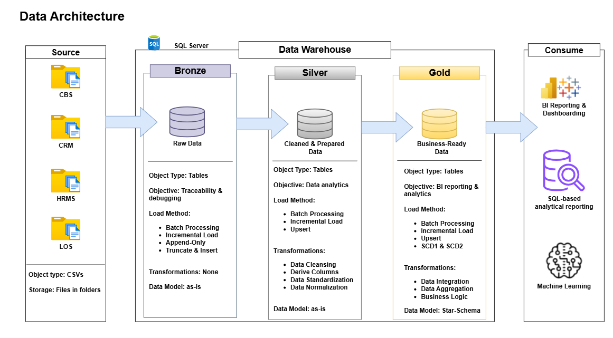
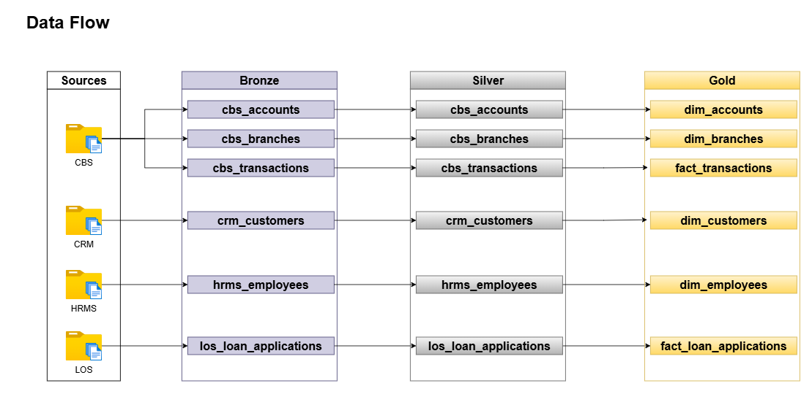

# Banking Data Warehouse — SQL Server Medallion Architecture

Welcome to my **SQL Server Banking Data Warehouse** — a fully hands-on,
end-to-end data engineering project built from the ground up on Microsoft
SQL Server. This project simulates a real-world banking data engineering
environment, covering every layer of the modern data warehouse stack:
architecture design, ETL pipeline development, data modelling, data quality,
and analytical readiness.

The project is built on the **Medallion Architecture (Bronze → Silver → Gold)**,
a widely adopted pattern in enterprise data warehousing that progressively
refines raw data into clean, conformed, and business-ready information. Every
design decision — from schema naming conventions to stored procedure structure
to SCD classification — is grounded in industry practice and deliberately
reasoned.

---

## Project Overview

A mid-sized fictional bank, **First National Bank**, operates across multiple
internal systems that independently manage customers, accounts, transactions,
loans, employees, and branches. Each system generates data in its own format,
on its own schedule, with no shared keys or unified structure.

The goal of this project is to consolidate all of that data into a single,
governed, analytically powerful Data Warehouse — built entirely in SQL Server
using stored procedures, schemas, and T-SQL as the primary implementation
language. No external orchestration tools. No notebooks. No Python. Pure SQL,
end to end.

### Source Systems

| Source System | Abbreviation | Data It Owns |
|---|---|---|
| Core Banking System | CBS | Accounts, Transactions, Branches |
| Customer Relationship Management | CRM | Customers |
| Loan Origination System | LOS | Loan Applications |
| Human Resource Management System | HRMS | Employees |

Raw data arrives as **CSV flat file exports** — simulating the most common
real-world integration pattern for batch ETL pipelines. Data quality issues
are intentionally present across all source files, including NULL values,
duplicate records, orphan foreign keys, future-dated timestamps, and
domain constraint violations.

---

## Project Requirements

**Data Engineering**
- Design and implement a multi-layer Data Warehouse using the Medallion
  Architecture (Bronze, Silver, Gold) on SQL Server

- Model source data across four independent systems (CBS, CRM, HRMS, LOS)
  into a unified conformed dimensional model using Star Schema

- Implement a fully logged ETL pipeline using domain-grouped stored procedures
  — one per source system per layer — with a dedicated key reconciliation
  procedure and four-procedure orchestration layer for automated pipeline
  execution

- Build a production-grade ETL logging and auditing framework that tracks
  every batch, every step, and every error across all layers

- Apply industry-standard load strategies per layer:
  - Bronze → Incremental Append-Only and Full Truncate & Insert
  - Silver → Incremental Update & Insert
  - Gold → Incremental SCD1, SCD2, Expire & Insert, and Append-Only

- Implement mixed SCD strategies across Gold dimensions — SCD Type 1 for
  stable attributes, SCD Type 2 for analytically significant slowly changing
  attributes across dim_customers and dim_accounts

- Resolve cross-system surrogate key dependencies via a dedicated
  reconciliation procedure — handling circular references between dimension
  tables loaded from different source systems

- Enforce audit column standards appropriate to each layer and load type
  for full data lineage traceability

- Handle source system deletions via soft-delete flags — Bronze uses
  Append-Only for transactional tables and Truncate & Insert for
  reference tables such as hrms_employees

**Standards & Quality**
- All database objects follow a defined naming convention documented
  in `/docs/naming_conventions.md`
- All tables carry audit columns appropriate to their layer and load type
- Scripts are numbered sequentially and self-contained — executable in
  order without dependencies outside the repo
- The repository is structured to be navigable by any data engineer
  without prior context

---

## Data Architecture

The warehouse is built on the **Medallion Architecture**, implemented entirely
within SQL Server. Data flows from source systems through three progressive
layers before reaching the consumption layer.

| Layer | Purpose | Load Strategy |
|---|---|---|
| **Bronze** | Raw ingestion — data stored as-is from source | Incremental Append-Only / Truncate & Insert |
| **Silver** | Cleansed, standardised, and deduplicated data | Incremental Update & Insert |
| **Gold** | Business-ready dimensional model | SCD1, SCD2, Expire & Insert, Append-Only |

---

## Data Flow

Data moves unidirectionally through the layers — Bronze feeds Silver,
Silver feeds Gold. No layer reads from a layer above it.

---

## Key Design Decisions

**Why domain-grouped procedures over table-level procedures?**

Grouping by source system mirrors how data arrives — CBS data is loaded
together, CRM data together. This reduces batch log fragmentation, simplifies
orchestration, and reflects the natural ownership boundaries of source systems.

**Why mixed SCD types across Gold dimensions?**

SCD type selection is a dimension-by-dimension decision driven by analytical
value. dim_customers and dim_accounts track attributes that change slowly and
meaningfully — segment, risk band, account status, interest rate. dim_employees
and dim_branches track operational state where only current values matter.
Applying SCD2 uniformly to all dimensions would add complexity without
proportional analytical return.

**Why a dedicated reconciliation procedure?**

dim_branches and dim_employees have a circular dependency — branches reference
their manager (an employee) and employees reference their branch. Neither can
be fully resolved during initial load. etl.reconcile_gold_keys runs after all
Gold tables are populated, resolving these cross-system key dependencies in a
single, auditable step.

**Why surrogate keys in fact tables?**

Fact tables reference dimension surrogate keys — not natural keys — for two
reasons. First, surrogate keys are INT (4 bytes) vs NVARCHAR (up to 100 bytes),
significantly improving join performance at scale. Second, SCD2 dimensions have
multiple rows per entity — joining on natural key returns multiple versions.
Surrogate keys pin the fact row to the exact dimension version that was active
at event time.

---

## Project Roadmap

* Architecture design and repository setup
* Bronze layer — DDL and ETL procedures
* Silver layer — DDL, ETL procedures, and quality checks
* Gold layer — DDL, ETL procedures, views, and integration checks
* Orchestration layer — Bronze, Silver, Gold, and master pipelines
* Documentation — architecture diagrams, data dictionary, naming conventions

---

## Tools & Technologies

| Tool | Purpose |
|---|---|
| Microsoft SQL Server | Database engine and primary implementation environment |
| SQL Server Management Studio (SSMS) | Query development and execution interface |
| T-SQL | ETL scripting, stored procedures, data modelling |
| Draw.io | Architecture, data flow, integration, and data model diagrams |
| GitHub | Version control and portfolio hosting |
| Notion | Project planning and task management |

---

## License

This project is licensed under the **MIT License**. You are free to use,
modify, or share with proper attribution.

---

## About Me

Hi there! I am **Otusanya Toyib Oluwatimilehin**, an aspiring Data Engineer
passionate about building reliable data pipelines, well-structured data
models, and analytically powerful data warehouses.

📧 toyibotusanya@gmail.com
📞 07082154436
